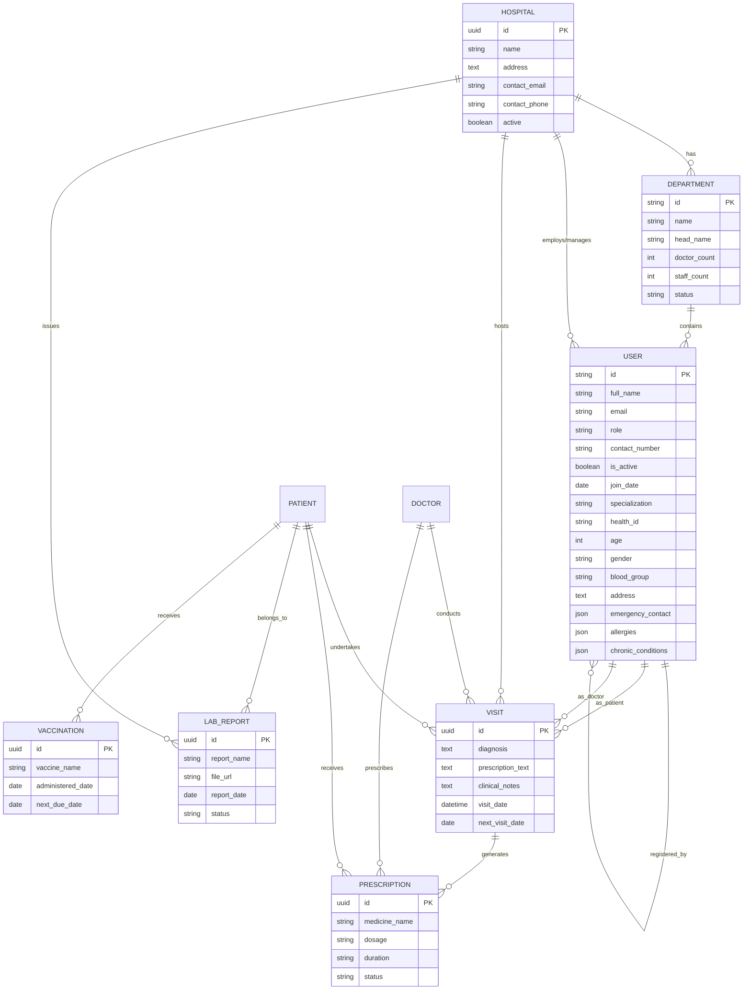

# Project Entity-Relationship Diagram

This document contains the ER diagram for the **Digital Health Care Record System**, visualized using Mermaid.js.

## ER Diagram (Mermaid)

## Key Entities Description

- **USER (Profile)**: A unified model for all system users (Admins, Doctors, Patients, Staff). Roles define the available attributes (e.g., `specialization` for doctors, `health_id` for patients).
- **HOSPITAL**: Represents a healthcare facility registered in the system.
- **DEPARTMENT**: Functional units within a hospital (e.g., Cardiology, Radiology).
- **VISIT**: Records a clinical encounter between a doctor and a patient at a specific hospital.
- **PRESCRIPTION**: Medication details linked to a visit or issued directly to a patient.
- **LAB_REPORT**: Medical test results uploaded to a patient's record.
- **VACCINATION**: Immunization history for patients.

## Instructions to View

To render this diagram:

1. View it in a Markdown editor that supports Mermaid (like VS Code with Mermaid extension, GitHub, or GitLab).
2. Copy the Mermaid code block into the [Mermaid Live Editor](https://mermaid.live/).
